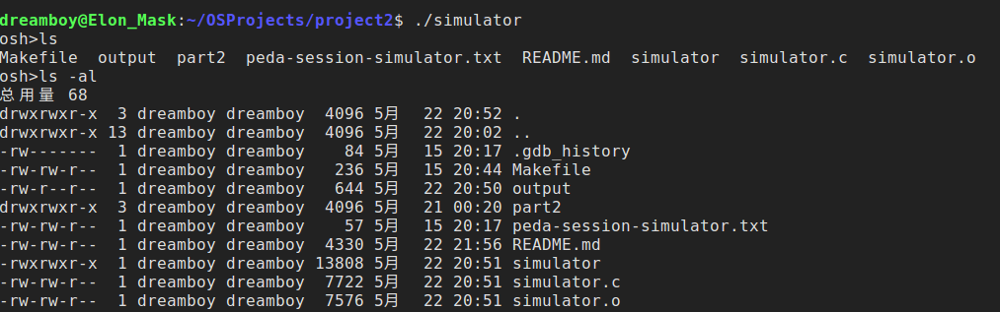
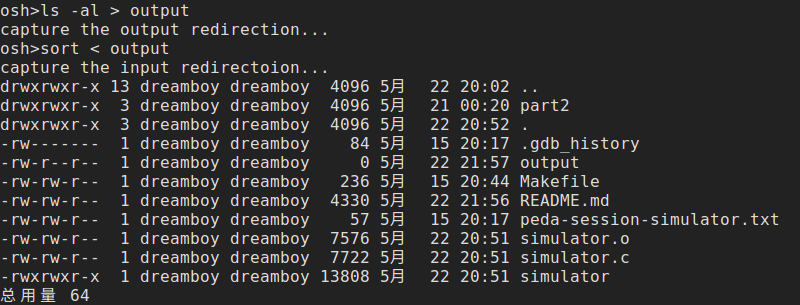
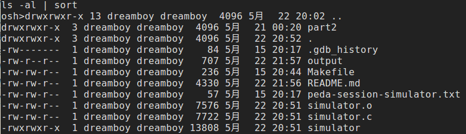

## Project2: Unix-shell programming & LKM for task information
### Background knowledge
&emsp;&emsp;In this project we will use some C functions in Linux. First I introduce some of them as belows:
``` C
#include <unistd.h>
#include <signal.h>
/* copy the file descriptor. This function will find a minimum
avaiable file descriptor and sets its pointer according to the oldfd(i.e.
the two fd will point to the same file) */
int dup(int oldfd);
/* just a little different from dup(), dup2() can specify the newfd
we want to use. It the newfd is already opened, this function will first close it and reopen */
int dup2(int oldfd, int newfd);

/* exec function family. `file` command will be search in $(PATH)
environment variable and argv need to be the arguments list
example: execvp("ls", {"ls", "-al", NULL})*/
execvp(const char *file, const char *argv[]);
...
/* when creating child processes, if the parent process
  does not wait until its child exits, the child process will possibly become a zombie. In this case we can use the following
  function to ask init process to release the resources of the child process. For more details refer to
  https://www.geeksforgeeks.org/zombie-processes-prevention/ */
signal(SIGCHID, SIG_IGNORE);
```

### Part A: Unix shell programming
> source code is available in project2/simulator.c

#### Step1: Main logic and analysis
&emsp;&emsp;Use a while loop(parent process) to read the input and then create a seperate child process the handle this input
``` C
char *input = malloc(sizeof(char) * MAX_LINE);

while(should_run){
  printf("osh>");
  fflush(stdout);

  fgets(input, MAX_LINE, stdin);
  /* logic to handle the input */
}
```
#### Step2: Create a child process to execute the command
``` C
/* parse the input string into argument list valid_args */
pid_t pid;
pid = fork();
if(pid < 0){
  perror("fork error!\n");
  exit(1);
}else if(pid == 0){
  /* logic for the child process */
  res = execvp(valid_args[0], valid_args);
  if(res<0){
    perror("execute error!\n");
    exit(1);
  }
}
```

#### Step3: handle the '&'
&emsp;&emsp;In terminal we sometimes use the '&' to let the process run in the background. To implement this logic we simply need to modify a little bit about the parent process part
``` C
if(pid > 0){
  if(wait_flag) wait(NULL);
  else signal(SIGCHID, SIG_IGNORE); // prevent zombie
}
```
#### Step4: handle redirection
&emsp;&emsp;In terminal we often use the '>' or '<' to redirect the input or output(e.g. ls -al > output, sort < output). When implement this logic, we need to use dup2() function introduced above, closing stdout/stdin and open our own file-descriptor to put/get our results
``` C
/* parse the input and check whether there is a '<', '>',
  get the output file path and then set the flags accordingly
  here we take the output redirection as an example */
int fd = open(output_path, "w");
if(dup2(fd, 1) < 0) { perror("dup2 error!\n"); exit(1);}
close(fd);
```

#### Step5: handle pipeline
&emsp;&emsp;In terminal we often use pipeline "|" to execute our command(e.g. ls -al | sort). To implement this logic, we use the pipe() function, where the write port and read port will be the first command and second command executor accordingly. Also dup() function will be used.
``` C
/* first parse the input string to get the pipeline flag */
/* extra logic is also needed to get the arguments of the first
command and second command. Refer to the source code for more details */

if(pipeline_flag){
  int ppid;
  int fd[2];
  pipe(fd);
  ppid = fork();
  if(ppid == 0){
    /* child process of the child process */
    close(0);
    /* close the write port */
    close(fd[1]);
    dup(fd[0]);
    execvp(pipe_args[0], pipe_args);
  }else if(ppid > 0){
    /* child process */
    close(1);
    /* close the read port */
    close(fd[0]);
    dup(fd[1]);
    execvp(valid_args[0], valid_args);
  }
}
```


#### Reflection and Problems
&emsp;&emsp;There is still some problems in my implementation due to time and ability limitation :-)
* The implementation assumes that there are spaces on the both sides of '|' '<' '>'. Actually this can be solved by simply modify a little about the input parsing part.
* When using '&' or '|', 'osh>' print will be out of order. I have no idea how to solve this problem, though. Any pull request is welcome!

### Part B: LKM for task information
> This part will be mostly based on our implementation of project 1
> source code is avaiable at project2/part2/pid.c

&emsp;&emsp; The main logic here lies in the proc_read() and proc_write() functions. proc_write() function will be called once the user want to write to the /proc/pid file(e.g echo "1234" > /proc/pid) <br>
&emsp;&emsp;Once the user write some pid to the /proc/pid. We get the input and use pid_task(find_vpid(l_pid), PIDTYPE_PID) function to get corresponding task(refer to linux/sched.h for more details). And then once the user call proc_read(), we display the tsk->comm, tsk->state, tsk->pid. Note that logic for false pid need to be offered.
``` C
static ssize_t proc_read(struct file *file, char __user *usr_buf, size_t count, loff_t *pos)
{
        int rv = 0;
        char buffer[BUFFER_SIZE];
        static int completed = 0;
        struct task_struct *tsk = NULL;

        if (completed) {
                completed = 0;
                return 0;
        }

        tsk = pid_task(find_vpid(l_pid), PIDTYPE_PID);

        completed = 1;

        /* return 0 if no this pid */
        if( tsk == NULL)    return 0;
        else rv = sprintf(buffer, "command = %s pid = %d state = %ld\n", tsk->comm, tsk->pid, tsk->state);

        // copies the contents of kernel buffer to userspace usr_buf
        if (copy_to_user(usr_buf, buffer, rv)) {
                rv = -1;
        }

        return rv;
}

/**
 * This function is called each time we write to the /proc file system.
 */
static ssize_t proc_write(struct file *file, const char __user *usr_buf, size_t count, loff_t *pos)
{
        char *k_mem;

        // allocate kernel memory
        k_mem = kmalloc(count, GFP_KERNEL);

        /* copies user space usr_buf to kernel buffer */
        if (copy_from_user(k_mem, usr_buf, count)) {
		printk( KERN_INFO "Error copying from user\n");
                return -1;
        }

	/**
 	 * kstrol() will not work because the strings are not guaranteed
	 * to be null-terminated.
	 *
	 * sscanf() must be used instead.
	 */
        sscanf(k_mem, "%ld", &l_pid);

        kfree(k_mem);

        return count;
}

```
